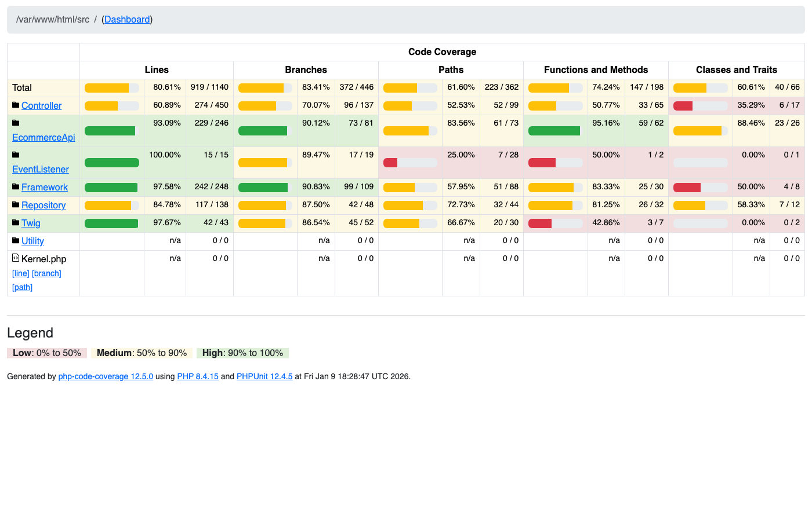
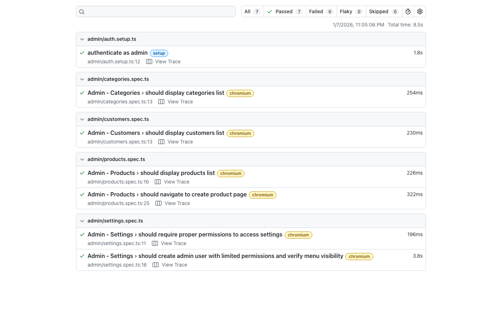
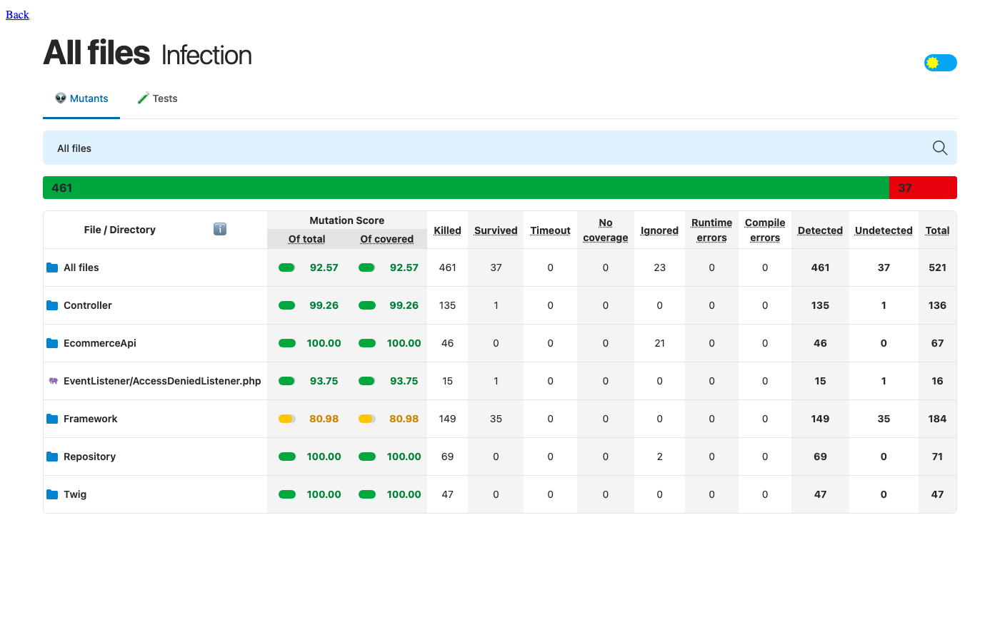
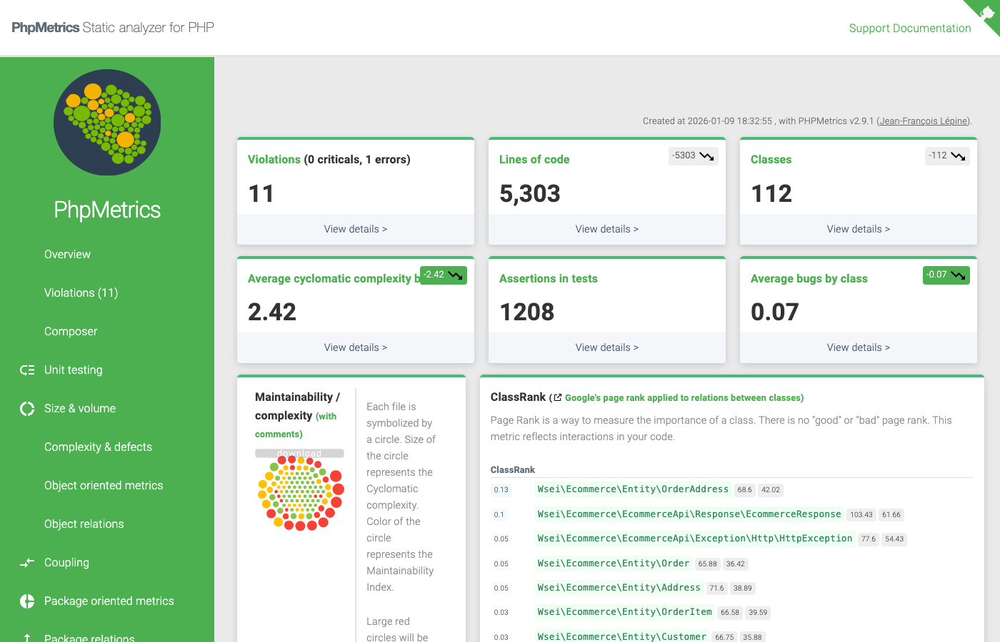

## Table of Contents

1. [PHPUnit Tests](#phpunit-tests)
   - [Test Configuration](#test-configuration)
   - [Test Suites](#test-suites)
   - [Running Tests](#running-tests)
   - [Code Coverage](#code-coverage)
   - [Integration Test Utilities](#integration-test-utilities)
2. [E2E Tests (Playwright)](#e2e-tests-playwright)
   - [Configuration](#e2e-configuration)
   - [Running E2E Tests](#running-e2e-tests)
   - [HTML Reports](#html-reports)
3. [Mutation Testing (Infection)](#mutation-testing-infection)
   - [What is Mutation Testing?](#what-is-mutation-testing)
   - [Running Infection](#running-infection)
   - [Viewing Results](#infection-results)
4. [PHPMetrics](#phpmetrics)
   - [What are PHP Metrics?](#what-are-php-metrics)
   - [Running PHPMetrics](#running-phpmetrics)
   - [Analyzing Results](#phpmetrics-results)
5. [Quick Reference](#quick-reference)

---

## PHPUnit Tests

### Test Configuration

**PHPUnit Version:** `^12.4`

The project uses PHPUnit as the primary testing framework. Configuration files are located in the `ecommerce/` directory:

| File | Purpose |
|------|---------|
| `phpunit.dist.xml` | Standard test configuration |
| `phpunit.dist.coverage.xml` | Test configuration with coverage enabled |

**Key Configuration Settings:**

```xml
<!-- Strict error handling -->
<phpunit failOnDeprecation="true"
         failOnNotice="true"
         failOnWarning="true">

<!-- Database transaction rollback extension -->
<extensions>
    <bootstrap class="DAMA\DoctrineTestBundle\PHPUnit\PHPUnitExtension" />
</extensions>
```

The `DAMA\DoctrineTestBundle` extension ensures that all database changes made during tests are automatically rolled back, providing test isolation.

### Test Suites

The project defines two test suites:

| Suite | Directory | Purpose |
|-------|-----------|---------|
| **UnitTests** | `tests/UnitTest/` | Fast, isolated unit tests with mocked dependencies |
| **IntegrationTests** | `tests/IntegrationTest/` | Tests that interact with real services and database |

**Unit Tests** extend `PHPUnit\Framework\TestCase` and test individual components in isolation.

**Integration Tests** extend either:
- `Symfony\Bundle\FrameworkBundle\Test\KernelTestCase` - for service-level testing
- `Symfony\Bundle\FrameworkBundle\Test\WebTestCase` - for HTTP request testing

### Running Tests

> ⚠️ **Important:** Always run tests inside the Docker container using `make` commands.

```bash
# Run all tests
make php-run-tests

# Run only unit tests
make php-exec CMD="composer test:unit"

# Run only integration tests
make php-exec CMD="composer test:integration"

# Run tests with additional PHPUnit flags
make php-run-tests FLAGS="--filter=CustomerAuthControllerTest"
```

### Code Coverage

To generate code coverage reports:

```bash
# Run tests with coverage (generates HTML report)
make php-exec CMD="composer test:coverage"

# Or use the dedicated coverage check command
make php-coverage-check
```

**Generated Coverage Files:**

| Path | Format | Description |
|------|--------|-------------|
| `ecommerce/phpunit-coverage/html/index.html` | HTML | Visual coverage report |
| `ecommerce/phpunit-coverage/cobertura.xml` | XML | Cobertura format for CI tools |
| `ecommerce/phpunit-coverage/coverage.clover` | XML | Clover format |

**Viewing the Coverage Report:**

Open the HTML report in your browser:
```bash
open ecommerce/phpunit-coverage/html/index.html
```



The coverage report shows:
- **Line coverage** - percentage of code lines executed during tests
- **Branch coverage** - percentage of code branches (if/else paths) covered
- **Method coverage** - percentage of methods called during tests

### Integration Test Utilities

The project provides reusable traits in `tests/IntegrationTest/Utils/Traits/` to simplify test creation:

| Trait | Purpose |
|-------|---------|
| `BuildsCustomers` | Creates customer entities with optional API tokens |
| `BuildsProducts` | Creates product entities for testing |
| `BuildsCategories` | Creates category entities |
| `BuildsAddresses` | Creates customer address entities |

**Example Usage:**

```php
use Symfony\Bundle\FrameworkBundle\Test\WebTestCase;
use Wsei\Ecommerce\Tests\IntegrationTest\Utils\Traits\BuildsCustomers;
use Wsei\Ecommerce\Tests\IntegrationTest\Utils\Traits\BuildsProducts;

class MyApiTest extends WebTestCase
{
    use BuildsCustomers;
    use BuildsProducts;

    protected function setUp(): void
    {
        $this->client = static::createClient();
    }

    public function testSomething(): void
    {
        // Create a customer with API token for authenticated requests
        $customer = $this->createCustomerWithToken();
        
        // Create a product
        $product = $this->createProduct(name: 'Test Product', price: 99.99);
        
        // Make authenticated API request
        $this->client->jsonRequest('GET', '/ecommerce/api/v1/products', [], [
            'HTTP_wsei-ecommerce-token' => $customer->getApiToken()->getToken(),
        ]);
        
        $this->assertResponseIsSuccessful();
    }
    
    protected function getEntityManager(): EntityManagerInterface
    {
        return static::getContainer()->get(EntityManagerInterface::class);
    }
}
```

**Abstract Test Classes:**

For complex test scenarios, extend abstract test classes like `AbstractOrderPlacementTest` which provides:
- Pre-configured client setup
- Helper methods for cart operations
- Authentication header builders
- JSON response parsing

---

## E2E Tests (Playwright)

The E2E tests are located in the `e2e-tests/` directory and use Playwright for browser automation.

**Playwright Version:** `^1.57.0`

### E2E Configuration

Configuration file: `e2e-tests/playwright.config.ts`

**Key Settings:**
- **Test timeout:** 30 seconds
- **Base URL:** `http://localhost:8080` (configurable via `BASE_URL` env variable)
- **Browser:** Chromium (default), with support for Firefox and WebKit
- **Authentication:** Pre-saved authentication state for admin tests

### Running E2E Tests

> ⚠️ **Prerequisites:** Docker containers must be running (`make up`)

```bash
# Navigate to e2e-tests directory
cd e2e-tests

# Install dependencies (first time only)
npm install
npm run install:browsers

# Run all tests
npm test

# Run tests in headed mode (visible browser)
npm run test:headed

# Run tests with UI mode (interactive)
npm run test:ui

# Run tests in debug mode
npm run test:debug

# Run only admin tests
npm run test:admin

# Run only Chromium tests
npm run test:chromium
```

**Interactive Mode:**

For developing and debugging tests, use the UI mode:

```bash
npm run test:ui
```

This opens an interactive interface where you can:
- Select specific tests to run
- Watch tests execute in real-time
- View test traces and screenshots
- Re-run failed tests

### HTML Reports

After test execution, Playwright generates an HTML report:

```bash
# View the HTML report
npm run report
```

This opens the report at `e2e-tests/playwright-report/index.html`



The report includes:
- Test results summary (passed/failed/skipped)
- Test execution timeline
- Screenshots of failures
- Video recordings (on failure)
- Test traces for debugging

**Test Artifacts:**

| Directory | Content |
|-----------|---------|
| `e2e-tests/playwright-report/` | HTML report files |
| `e2e-tests/test-results/` | Screenshots, videos, and traces |

---

## Mutation Testing (Infection)

### What is Mutation Testing?

Mutation testing evaluates the quality of your test suite by introducing small changes (mutations) to your code and checking if tests detect these changes.

**How it works:**
1. Infection modifies your source code (e.g., changes `>` to `>=`, `true` to `false`)
2. It runs your tests against each mutation
3. If tests fail, the mutation is **killed** (good - tests caught the bug)
4. If tests pass, the mutation **escaped** (bad - tests didn't catch the bug)

A high mutation score indicates a robust tests quality.

**Infection Version:** `^0.31.9`

### Running Infection

```bash
# Run infection mutation testing
make infection
```

Or with the full composer script:

```bash
make php-exec CMD="composer test:infection"
```

> **Note:** Infection requires code coverage data. It uses the PHPStan static analysis integration for faster execution.

### Infection Results

After running, Infection generates reports in `ecommerce/infection-coverage/`:

| File | Purpose |
|------|---------|
| `infection.html` | Interactive HTML report |
| `infection.log` | Detailed text log of all mutations |
| `summary.log` | Quick summary of results |

**Viewing the HTML Report:**

```bash
open ecommerce/infection-coverage/infection.html
```



**Understanding the Summary:**

```
Total: 521

Killed by Test Framework: 457    # Tests caught these mutations
Killed by Static Analysis: 4     # PHPStan caught these mutations
Escaped: 37                      # Mutations NOT caught (needs more tests)
Skipped: 23                      # Skipped due to configuration
```

**Mutation Score Indicator (MSI):** Aim for > 80% killed mutations.

---

## PHPMetrics

### What are PHP Metrics?

PHPMetrics analyzes your PHP codebase and provides insights on:
- **Complexity** - Cyclomatic and cognitive complexity
- **Coupling** - Dependencies between classes
- **Cohesion** - How focused classes are on single responsibilities
- **Size** - Lines of code, methods per class
- **Violations** - Potential code smells and issues

**PHPMetrics Version:** `^2.9`

### Running PHPMetrics

```bash
make phpmetrics
```

This generates a comprehensive HTML report.

### PHPMetrics Results

Reports are generated in `ecommerce/phpmetrics/`:

| Page | Description |
|------|-------------|
| `index.html` | Dashboard with overview metrics |
| `complexity.html` | Complexity analysis |
| `coupling.html` | Class coupling and dependencies |
| `violations.html` | Code quality violations |
| `oop.html` | Object-oriented metrics |
| `package_relations.html` | Package dependency graph |

**Viewing the Report:**

```bash
open ecommerce/phpmetrics/index.html
```



**Key Metrics to Monitor:**

| Metric | Good Range | Description |
|--------|------------|-------------|
| Cyclomatic Complexity | < 10 | Number of decision points in code |
| Maintainability Index | > 50 | Higher is better maintained |
| Afferent Coupling | Low | Classes that depend on this class |
| Efferent Coupling | Low | Classes this class depends on |
| LCOM | Close to 1 | Lack of Cohesion (lower is better) |

---

## Quick Reference

### Commands Summary

| Task | Command |
|------|---------|
| Run all PHP tests | `make php-run-tests` |
| Run unit tests only | `make php-exec CMD="composer test:unit"` |
| Run integration tests only | `make php-exec CMD="composer test:integration"` |
| Generate coverage report | `make php-exec CMD="composer test:coverage"` |
| Run mutation tests | `make infection` |
| Run PHPMetrics | `make phpmetrics` |
| Run PHPStan | `make phpstan` |
| Run code style check | `make ecs` |
| Fix code style | `make ecs-fix` |
| Run E2E tests | `cd e2e-tests && npm test` |
| Run E2E tests (UI) | `cd e2e-tests && npm run test:ui` |
| View E2E report | `cd e2e-tests && npm run report` |

### Report Locations

| Report | Location |
|--------|----------|
| PHPUnit Coverage | `ecommerce/phpunit-coverage/html/index.html` |
| Infection | `ecommerce/infection-coverage/infection.html` |
| PHPMetrics | `ecommerce/phpmetrics/index.html` |
| Playwright | `e2e-tests/playwright-report/index.html` |

### Test Database Setup

Before running integration tests for the first time:

```bash
# Initialize test database
make php-test-init

# Re-initialize (drop existing and recreate)
make php-test-init CLEAR_EXISTING=true
```

---

## Additional Resources

- [PHPUnit Documentation](https://docs.phpunit.de/en/12.4/)
- [Playwright Documentation](https://playwright.dev/docs/intro)
- [Infection Documentation](https://infection.github.io/)
- [PHPMetrics Documentation](https://www.phpmetrics.org/)
- [Symfony Testing](https://symfony.com/doc/7.4/testing.html)

