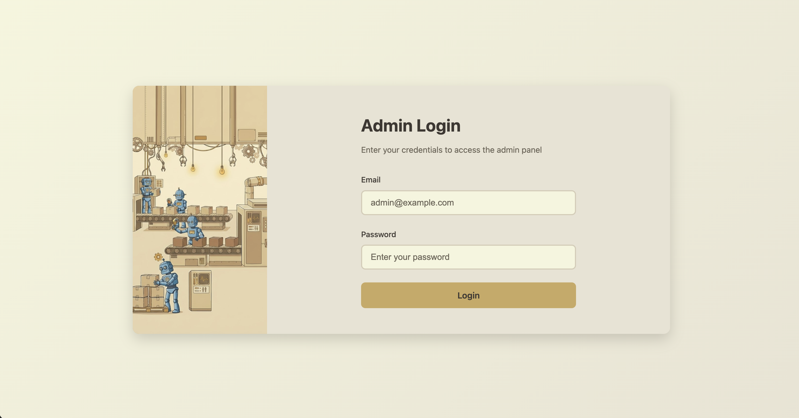
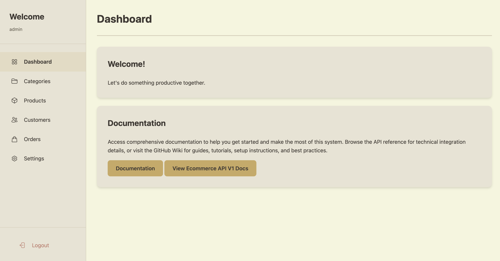
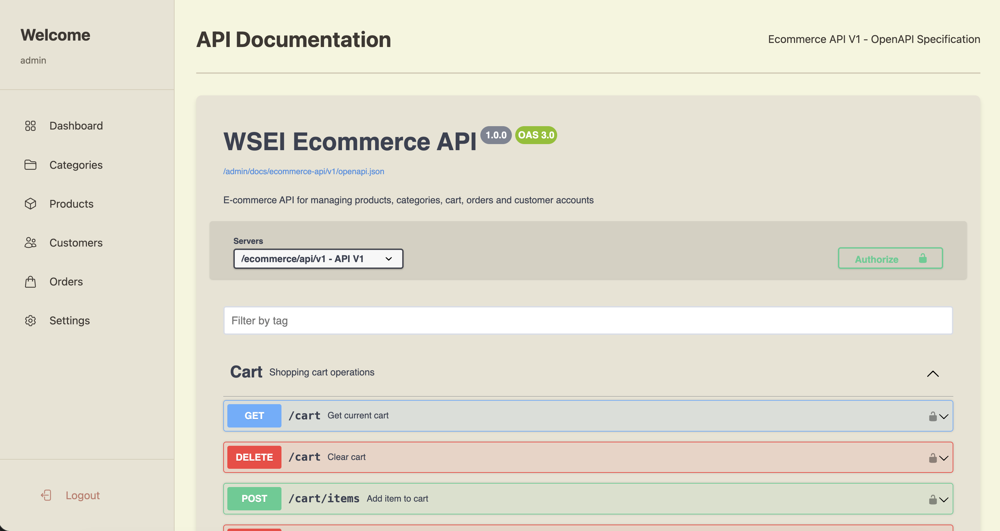
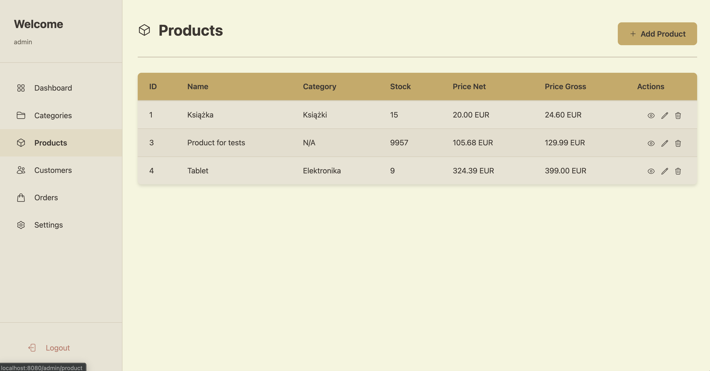
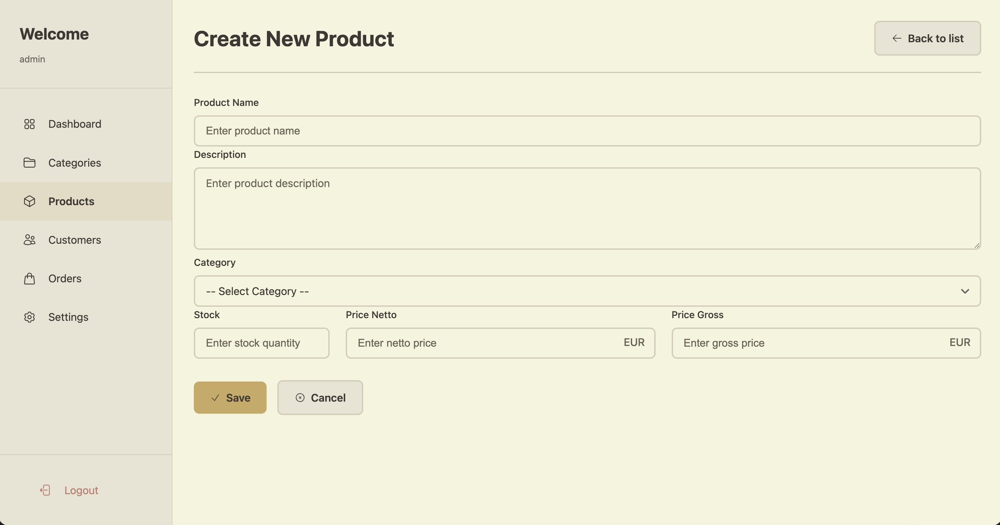
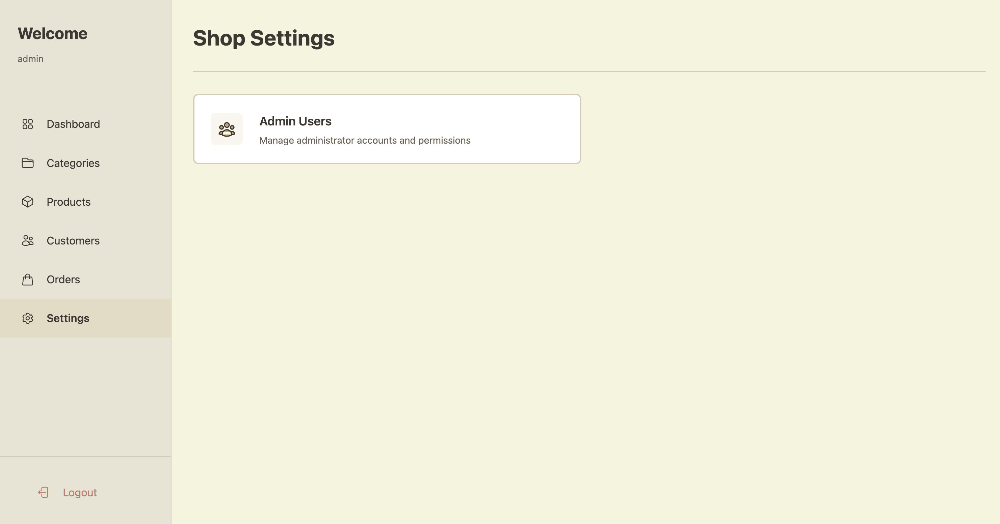
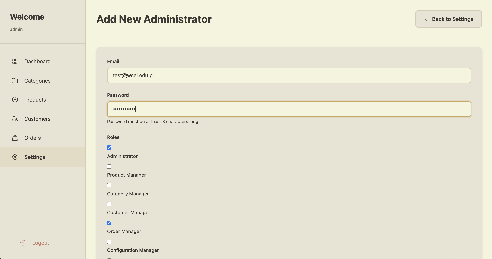
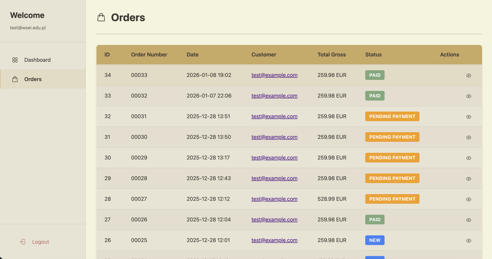

# User Manual

This manual provides step-by-step instructions for using the WSEI E-commerce administration panel.

## Accessing the Administration Panel

Navigate to the application at `http://localhost:8080/`. You will be automatically redirected to the login page, or you can access it directly at `http://localhost:8080/admin`.

**Default Credentials:**
- Username: `admin`
- Password: `password`

After logging in, you will access the admin panel with super administrator privileges.

## Dashboard Overview

The dashboard provides quick access to all management sections through the sidebar navigation on the left side of the screen.
### Accessing API Documentation

The administration panel provides direct access to the interactive API documentation. Click on the **"View Ecommerce API V1 Docs"** link in the top-right corner of the screen to access the Swagger/OpenAPI specification interface.

This interactive documentation allows you to:
- Browse all available API endpoints
- View request/response schemas
- Test API calls directly from the browser
- Understand authentication requirements

## Managing Products

Most entity management pages in the application follow a similar structure. This section uses the Products page as an example.

### Viewing Products

Click on the **Products** tab in the sidebar to view all products.

Each product row displays action icons that allow you to:
- **View** product details
- **Edit** product information
- **Delete** the product

### Adding a New Product

1. Click the **Add product** button in the top-right corner
2. Fill in the product form with required information

3. Click **Save** to create the product
4. You will be redirected to the products list where the new product is now displayed

**Note:** Other entity management pages (Categories, Customers, Orders) follow the same workflow.

## Settings

### Managing Administrators

The Settings section allows you to create additional administrator accounts and configure their permissions.

1. Navigate to **Settings** in the sidebar
2. Select **Admin Users** to view the list of all administrators
3. Click **Add** to create a new administrator account

### Configuring User Permissions

When creating or editing an administrator, you can assign specific role-based permissions. For example, to create an administrator who can only view and manage orders:

1. Select only the **Order Manager** role
2. Scroll down and click **Save**

### Permission-Based Access

When the new administrator logs in, they will only see the sections they have permission to access:

In this example, the administrator can only access the Orders section based on their assigned permissions.
